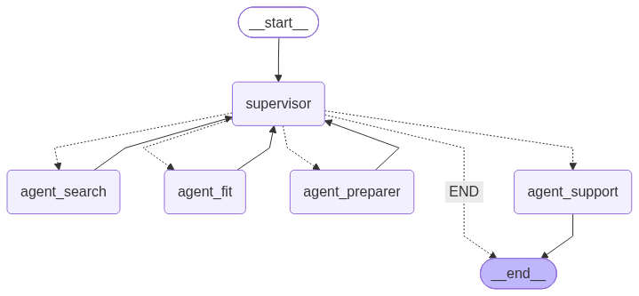

# LangGraph-Career-Copilot

- ⚠️ Projeto em desenvolvimento inicial. Este README serve como anotação de progresso e roadmap

Grafo que utiliza um supervisor para rotear tarefas entre agentes especialistas, para auxílio com busca de vagas de emprego.

## Arquitetura planejada
 
- **Supervisor**: decide entre buscar vaga, avaliar fit, ou preparar entrevista
- **Agente Buscador de Vagas** — RAG/tool sobre um conjunto de descrições de vagas (via MCP do Indeed)
- **Agente Fit** — compara um currículo-exemplo com a descrição da vaga e aponta gaps
- **Agente Prep de Entrevista** — gera perguntas prováveis com base na vaga

## Diagrama do grafo
 


## Stack
 
- **LangGraph** — orquestração do grafo (supervisor + especialistas)
- **FastAPI** — camada HTTP, grafo compilado uma vez no `lifespan` da app
- **Groq** (`openai/gpt-oss-20b`) — LLM escolhido para o supervisor e os agentes por:
  - **Multilíngue**: bom desempenho tanto em português quanto em inglês, o que importa diretamente pra busca semântica do RAG
  - **Baixo custo de token**: viabiliza rodar o projeto inteiro dentro do tier gratuito da Groq, sem custo pra manter como projeto de portfólio
  - **Suporte a tools**: essencial pro padrão de agente ReAct usado nos nós especialistas (function calling nativo)
- **MCP** — integração com o servidor da Indeed (`search_jobs`, `get_job_details`, `get_company_data`, `get_resume`) via `langchain-mcp-adapters`
- **Checkpointer plugável** — `MemorySaver` em dev, `AsyncPostgresSaver` em produção (troca por variável de ambiente `APP_ENV`)

## Como rodar (modo dev)
 
```bash
python -m venv venv
venv\Scripts\activate
pip install -r requirements.txt
uvicorn app.main:app --reload
```
 
Documentação interativa em `http://127.0.0.1:8000/docs`.